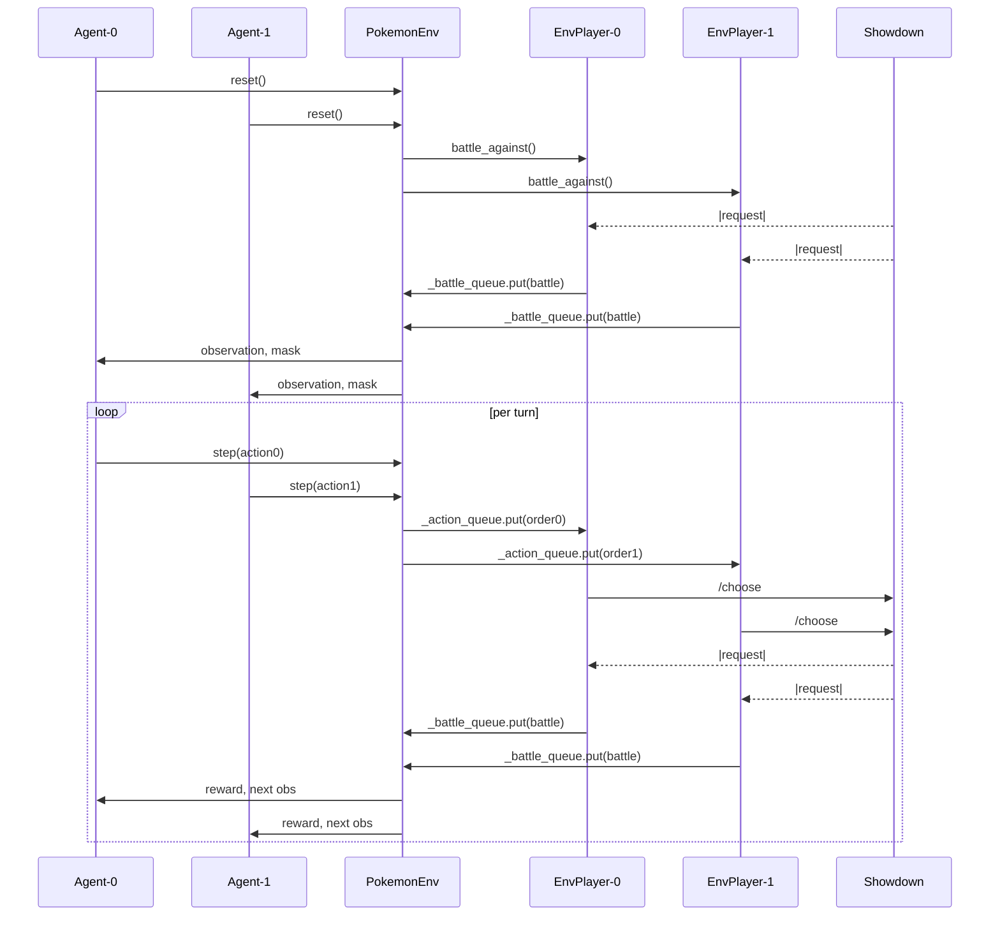

# PokemonEnv 技術仕様書 — Maple Project

## 1. 目的
本ドキュメントは、Maple プロジェクトの `pokemon_env.py` に定義された **PokemonEnv (Multi‑Agent Edition)** の技術仕様を、LLM がコード生成・補完の際に参照できる形式でまとめたものです。

---

## 2. poke_env と Showdown サーバー間の通信

| 項目 | 概要 |
| --- | --- |
| 接続方式 | **WebSocket** (`ws://localhost:8000`) |
| 使用ライブラリ | `poke_env` の `Player` と `ServerConfiguration` |
| 通信プロトコル | Pokémon Showdown テキストコマンド (`/team`, `/choose move 1`, など) |
| 対戦開始 | `EnvPlayer.play_against(opponent, n_battles=1)`を2インスタンス同時に起動し、両エージェントを対戦状態にする |
| メッセージフロー | 1. サーバーが `|request|` で始まるメッセージを送信 2. 各 `EnvPlayer`(P0/P1) は `battle.last_request` の変化を確認して `battle` を更新し、PokemonEnv へフラグ付きで送信 3. PokemonEnv は受け取った行動を `EnvPlayer` 経由でサーバへ送信 4. サーバが結果を返す |

* 各 `request` には昇順の `rqid` が付与され、乱序で届くことがある
* 同一ターンに複数の `request` が送られることがある

---

## 3. 同期 / 非同期処理

* 外部: `poke_env` は **asyncio**‐ベースで WebSocket を管理  
* PokemonEnv API: **同期的** (`reset()`, `step()`)
 * Multi‑Agent 対応に伴い、`step()` は dict 形式を返す*
  * 例:
    ```python
    obs = {"player_0": np.ndarray, "player_1": np.ndarray}
    action = {"player_0": int, "player_1": int}
    reward = {"player_0": float, "player_1": float}
    ```

* 手順
  1. 非同期処理は poke-env が保持する `POKE_LOOP` イベントループを利用し、同期 API からは `asyncio.run_coroutine_threadsafe(coro, POKE_LOOP)` でタスクを登録し `future.result()` で待機する
  2. バトル開始待ちや状態待ちは `asyncio.Queue.get()` や `asyncio.Event.wait()` を `asyncio.wait_for()` と組み合わせて実施し、ビジーウェイトを行わない
  3. `reset()` で `battle_against()` を呼び、対戦を開始
  4. `PokemonEnv`は`reset()`内で`EnvPlayer`からメッセージが来るのを待機
  5. `EnvPlayer`は`|teampreview|`のメッセージが届いたら`PokeonEnv`に`my_team: List`と`opp_team: List`を渡して、チーム選択を要求(この時点ではBattleオブジェクトは空である)
  6. `PokemonEnv`は`reset()`の戻り値として`state`と`info`、必要に応じて行動マスクを返す。
  7. `Agent`は`info`の情報からチーム選択が呼び出されたことを理解して、`step(choose_team(state))`を実行
  8. `PokemonEnv`はチーム選択を受け取り`EnvPlayer`に送信
  9. `EnvPlayer`はチーム選択をサーバに送信して新しい`request`を待つ
  10. `request`が発生したら`EnvPlayer`は`battle.last_request`が前回から変化したことを確認し、`battle`オブジェクトを更新して`PokemonEnv`に渡し`action`を待機する
  11. `PokemonEnv`は`Agent`にStateObserverを使って作成した情報ベクトルと、`action_helper.py`の`get_available_actions_with_details`で作成した選択可能な行動マスクを送信する。
  12. `Agent`は`choose_move(state,mask)`で行動を選択して、`step(action)`を呼ぶ
  13. `PokemonEnv`は`action`をキューに投入して、次の`request`フラグを待つ
  14. `EnvPlayer`(`poke-env`)は`action`を`battleorder`に変換してShowdownサーバに送信して、次の`request`を待つ
  15. `EnvPlayer`は次の`request`で`battle.last_request`が更新されたことを検知してから`battle`を`PokemonEnv`に送信し、再度`action`を待機する
 16. `PokemonEnv`は`step(action)`の戻り値として`state(observation)`、`reward`、`terminated`/`truncated` 判定、`info` を返し、`return_masks=True` のときは次の行動マスクも返す
  17. `Agent`は`受け取った情報から行動を選択して次の`step(action)`を呼ぶ

* 注意
* `step()` は `battle.turn` が変化しない場合に備えてタイムアウトを設ける

---

## 4. 観測（状態）空間

* 型: `gymnasium.spaces.Box(low=0, high=1, shape=(N,), dtype=np.float32)`
* 生成: `StateObserver`  
* 特徴量例  
  * 自分 / 相手アクティブポケモンの HP%, 種族, タイプ一 hot, 状態異常  
  * ベンチ 1・2 の HP%, 存在フラグ  
  * 技 1–4 の威力, タイプ一 hot, PP%  
  * 場の天候, フィールド, ターン数  
  * **タイプ相性 (`type_matchup_vec`)**: 18要素のベクトル。自分のアクティブポケモンの技1-4と相手ポケモン（アクティブ、ベンチ1、ベンチ2）の相性（12要素）、および相手アクティブポケモンのタイプ一致技と自分ポケモン（アクティブ、ベンチ1、ベンチ2）の相性（6要素）を示す。**ダメージ倍率はlog2変換が適用され、0倍→-10.0、0.25倍→-2、0.5倍→-1、1倍→0、2倍→1、4倍→2の範囲に変換される。変化技（Statusカテゴリの技）の場合、タイプ相性倍率は常に0.0（log2(1.0)）として計算される。**  
* One‑Hot 化・線形スケーリングで 0‑1 に正規化  
* 次元数: `StateObserver.get_observation_dimension()` で算出
* 観測は各プレイヤー視点で計算したベクトルを dict にまとめて返す

```text
observation = {
  "player_0": concat(
    own_active_stats,
    own_bench_1, own_bench_2,
    opp_active_stats,
    ...,
    global_field_info
  )
  "player_1":concat(...) #2p目線で計算
}
```

---

## 5. 行動空間

```
action_spaces = {
    "player_0": Discrete(11), # index 0‑10
    "player_1": Discrete(11)
}
```
`step()` には `{"player_0": action0, "player_1": action1}` の形で行動を渡す。`action` は整数インデックスまたはチーム選択等の文字列コマンドを許容する。

| Index | 意味 | 備考 |
| --- | --- | --- |
| 0‑3 | 技 1‑4 | `create_order(move_i)` |
| 4‑7 | テラスタルして技 1‑4 | `create_order(move_i, terastallize=True)` |
| 8‑9 | ベンチ 1 or 2 に交代 | `create_order(pokemon_j)` |
| 10 | Struggle | `create_order("move struggle")` |

* **ActionHelper**  
* `get_available_actions(battle) -> mask[11], mapping`
  * `action_index_to_order(player, battle, idx) -> BattleOrder`  

---

## 6. `reset()` / `step()` フロー



---

## 7. 報酬・エピソード終了

| 状況 | terminated["player_0"] | terminated["player_1"] | reward["player_0"] | reward["player_1"] |
| --- | --- | --- |
| 自分が勝利 | True | +10 |
| 相手が勝利 | True | -10 | +10 |
| ターン > MAX_TURNS | True (truncated) | 0 | 0 |
| 途中ターン | False | 0 |

報酬は `{"player_0": float, "player_1": float}` 形式で返る。

---

## 8. 実装ノート

* **遅延インポート**: `poke_env` は `reset()` 内でインポート
* **EnvPlayer**: 行動アルゴリズムは外部エージェントに委任
* **チームプレビュー**: `Agent.choose_team()` でチーム選択を行い `/choose team` を送信（デフォルトはランダム3匹選出）
* **再利用接続**: 各エピソード開始時に `reset_battles()`
* **step 待機処理**: `_race_get()` ヘルパーで `queue.get()` と `Event.wait()` を競合させ、タイムアウト付きで次の `battle` を取得する
* **行動要求フラグ**: `_need_action` で各プレイヤーの行動要否を管理し、`False` の場合は受け取った行動を無視して前ターンの `battle` を再利用
* **close() 実装**: `POKE_LOOP` 上のタスクをキャンセルし、キューの `join()` 後にリソースを解放する
* **依存**: `poke-env>=0.9`, Showdown server (localhost:8000)
* **Multi‑Agent dict API**: 観測・行動・報酬・terminated/truncated・info はすべて `"player_0"`, `"player_1"` キー付き dict
* **対戦組み合わせ**: 同一 MapleAgent の重み共有 or スナップショット固定など、訓練シナリオに応じて差し替え可能

---

## 9. 参考コードスニペット

```python
# 環境ベクトル取得
state: np.ndarray = state_observer.observe(battle)

# 行動マスク取得
mask, mapping = action_helper.get_available_actions(battle)

# 行動インデックス -> BattleOrder
order = action_helper.action_index_to_order(env_player, battle, idx)
next_obs, reward, terminated, truncated, info, masks = env.step(
    {
        "player_0": idx0,
        "player_1": idx1,
    },
    return_masks=True,
)
```

---

### 変更履歴
- 2025-06-12 Multi-Agent API 追加
- 2025-06-13 `_race_get` と `_need_action` を実装しステップ処理を更新

### End of File
