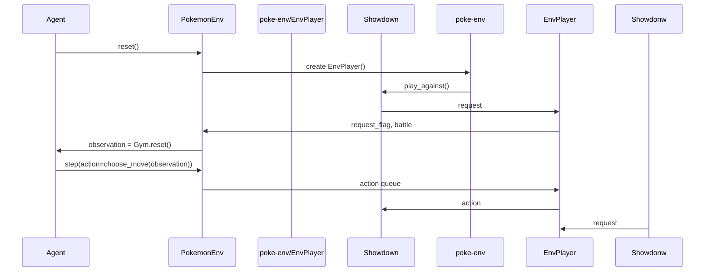

# PokemonEnv 技術仕様書 — Maple Project

## 1. 目的
本ドキュメントは、Maple プロジェクトの `pokemon_env.py` に定義された **PokemonEnv** クラスの技術仕様を、LLM がコード生成・補完の際に参照できる形式でまとめたものです。

---

## 2. poke_env と Showdown サーバー間の通信

| 項目 | 概要 |
| --- | --- |
| 接続方式 | **WebSocket** (`ws://localhost:8000`) |
| 使用ライブラリ | `poke_env` の `Player` と `ServerConfiguration` |
| 通信プロトコル | Pokémon Showdown テキストコマンド (`/team`, `/choose move 1`, など) |
| 対戦開始 | `EnvPlayer.play_against(opponent, n_battles=1)` |
| メッセージフロー | 1. サーバーが `|request|`で始まるメッセージを送信 2.EnvPlayer(PSClient)はメッセージを解析してbattleオブジェクトを更新して、PokemonEnvにフラグ付きで送信 3.EnvPlayerはPokemonEnvから帰ってきたコマンドをサーバに送信 4.サーバが結果を返す |

* 各 `request` には昇順の `rqid` が付与され、乱序で届くことがあるs
* 同一ターンに複数の `request` が送られることがある

---

## 3. 同期 / 非同期処理

* 外部: `poke_env` は **asyncio**‐ベースで WebSocket を管理  
* PokemonEnv API: **同期的** (`reset()`, `step()`)  

* 手順
  1. `reset()` で `play_against()` を呼び、対戦を開始
  2. 対戦が開始したら`EnvPlayer`はサーバからのメッセージを待機
  3. `request`が発生したら`EnvPlaer`は`PokemonEnv`に`battle`オブジェクトとフラグやキューを`PokemonEnv` にわたして`action`を待機する
  4. `PokemonEnv`は`Agent`にStateObserverを使って作成した情報ベクトルを渡す
  5. `Agent`はアルゴリズムに基づいて行動を決定し、`step(action)`を実行
  6. `PokemonEnv`は`action`をキューに投入して、次の`request`フラグを待つ
  7. `EnvPlayer`(`poke-env`)は`action`をShowdownサーバに送信する
  8. `EnvPlayer`は次の`request`が来たら`battle`を更新して`PokemonEnv`に渡して、再度`action`を待機する
  9. `PokemonEnv`は`step(action)`の戻り値として`Agent`に`battle`と`reward`を返す
  10. `Agent`は`battle`から行動を選択して次の`step(action)`を呼ぶ

* 注意
* `step()` は `battle.turn` が変化しない場合に備えてタイムアウトを設ける
---

## 4. 観測（状態）空間

* 型: `gymnasium.spaces.Box(low=0, high=1, shape=(N,), dtype=np.float32)`
* 生成: `StateObserver`  
* 特徴量例  
  * 自分 / 相手アクティブポケモンの HP%, 種族, タイプ一 hot, 状態異常  
  * ベンチ 1・2 の HP%, 存在フラグ  
  * 技 1–4 の威力, タイプ一 hot, PP%  
  * 場の天候, フィールド, ターン数  
* One‑Hot 化・線形スケーリングで 0‑1 に正規化  
* 次元数: `StateObserver.get_observation_dimension()` で算出  

```text
observation = concat(
    own_active_stats,
    own_bench_1, own_bench_2,
    opp_active_stats,
    ...,
    global_field_info
)
```

---

## 5. 行動空間

```
gymnasium.spaces.Discrete(10)  # index 0‑9
```

| Index | 意味 | 備考 |
| --- | --- | --- |
| 0‑3 | 技 1‑4 | `create_order(move_i)` |
| 4‑7 | テラスタルして技 1‑4 | `create_order(move_i, terastallize=True)` |
| 8‑9 | ベンチ 1 or 2 に交代 | `create_order(pokemon_j)` |

* **ActionHelper**  
  * `get_available_actions(battle) -> mask[10], mapping`  
  * `action_index_to_order(player, battle, idx) -> BattleOrder`  

---

## 6. `reset()` / `step()` フロー



---

## 7. 報酬・エピソード終了

| 状況 | `terminated` | `reward` |
| --- | --- | --- |
| 自分が勝利 | True | +1 |
| 自分が敗北 | True | -1 |
| ターン > `MAX_TURNS` | True (`truncated`) | 0 |
| 途中ターン | False | 0 |

---

## 8. 実装ノート

* **遅延インポート**: `poke_env` は `reset()` 内でインポート
* **EnvPlayer**: 行動アルゴリズムは外部エージェントに委任
* **チームプレビュー**: `Agent.teampreview()` でチーム選択を行い `/choose team` を送信（デフォルトはランダム3匹選出）
* **再利用接続**: 各エピソード開始時に `reset_battles()`
* **step 待機処理**: `rqid` が進むまで非同期でループし、タイムアウトを設ける
* **未実装**: `render()`, `close()` は将来拡張
* **依存**: `poke-env>=0.9`, Showdown server (localhost:8000)

---

## 9. 参考コードスニペット

```python
# 環境ベクトル取得
state: np.ndarray = state_observer.observe(battle)

# 行動マスク取得
mask, mapping = action_helper.get_available_actions(battle)

# 行動インデックス -> BattleOrder
order = action_helper.action_index_to_order(env_player, battle, idx)
```

---

### End of File
