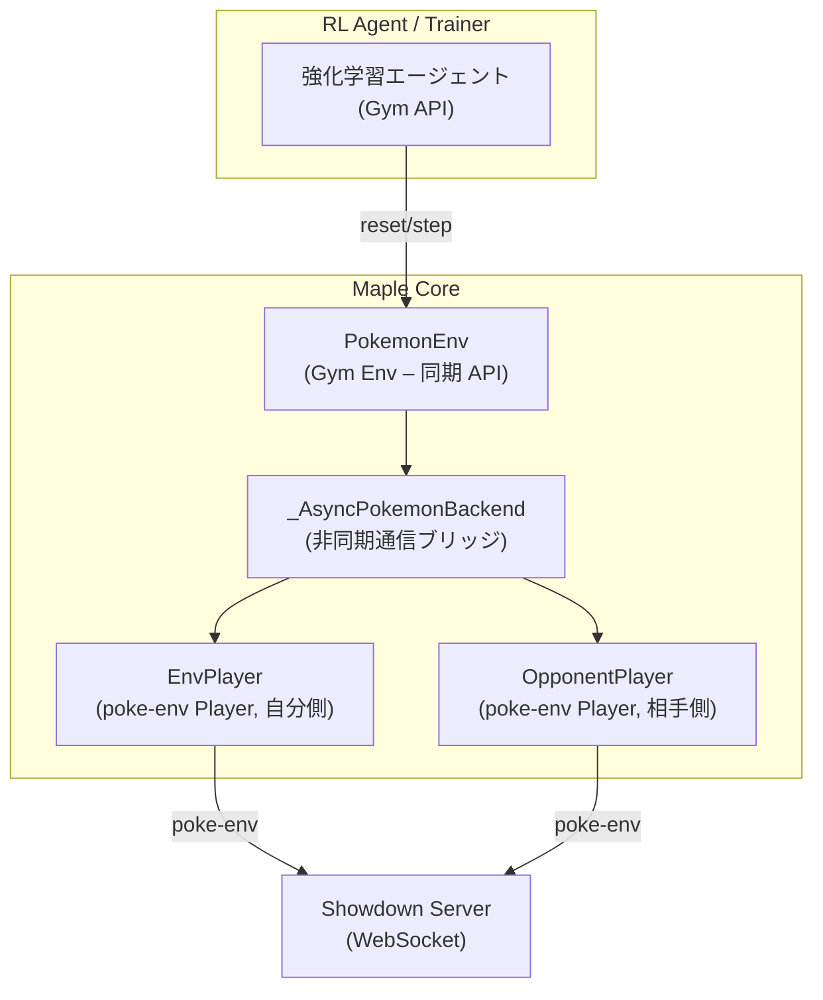
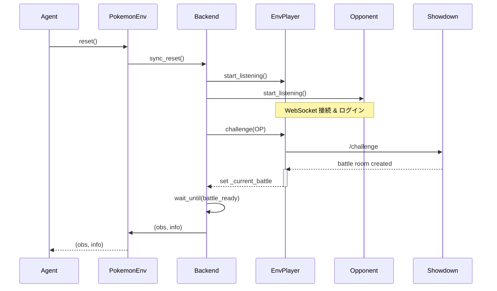
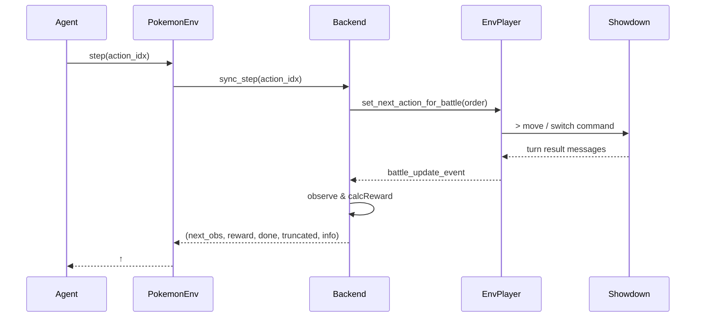

# Maple Project – Architecture Overview

Machine Assisted Pokémon Learning Environment (Maple) は、ポケモン対戦 AI の強化学習を目的とした Python ベースのフレームワークです。本ドキュメントは **通信設計** に重点を置き、Gymnasium 互換環境 `PokemonEnv` と poke‑env / Showdown サーバ間の相互作用を中心に、コンポーネント図・シーケンス図を用いて構造を説明します。

---

## 目次

1. システム全体図
2. 主要コンポーネント
3. 処理フロー

   1. `reset()` シーケンス
   2. `step()` シーケンス
   3. 強制交代フロー（参考）
4. エラー処理・タイムアウトポリシー
5. 拡張ポイント
6. 参考: ディレクトリ & 主要ファイル構成

---

## 1. システム全体図



* **同期境界**: `Agent ↔ PokemonEnv` は完全同期。
* **非同期境界**: `PokemonEnv ↔ _AsyncPokemonBackend` 以降は asyncio & WebSocket による非同期通信。
* **データフロー**: 観測 (`numpy.ndarray`) と行動インデックス (int) が同期レイヤを横断し、WebSocket メッセージへ変換される。

---

## 2. 主要コンポーネント

| コンポーネント                   | 役割                                                                                                 | 主要メソッド / 属性                                                                         |
| ------------------------- | -------------------------------------------------------------------------------------------------- | ----------------------------------------------------------------------------------- |
| **PokemonEnv**            | Gymnasium 互換環境。観測・行動空間の定義と同期 API (`reset`, `step`, `close`, `render`) を提供。                         | `observation_space`, `action_space`, `current_battle`                               |
| **\_AsyncPokemonBackend** | poke‑env / Showdown との非同期通信を担当。同期 API に対するブリッジを行う。                                                 | `sync_reset`, `sync_step`, `sync_close` (同期ラッパ)／ `_reset_async`, `_step_async` (実体) |
| **EnvPlayer**             | poke‑env の `Player` を拡張し、エージェント側プレイヤーとして対戦参加。`choose_move` で `Future` を返し、Gym `step` で行動が決定するまで待機。 | `choose_move`, `set_next_action_for_battle`                                         |
| **OpponentPlayer**        | 相手プレイヤー (例: `RandomPlayer`)。poke‑env が自動で行動決定。                                                     | n/a                                                                                 |
| **StateObserver**         | `Battle` オブジェクト → 観測ベクトルへエンコード。YAML で特徴量定義。                                                        | `observe`, `get_observation_dimension`                                              |
| **ActionHelper**          | 行動インデックス ↔ `BattleOrder` 相互変換。利用可能行動マスク生成。                                                         | `action_index_to_order`, `get_available_actions`                                    |
| **Showdown Server**       | 実際のバトルをシミュレートする Node.js サーバ。WebSocket でメッセージ交換。                                                    | バトルルーム, BattleEngine                                                                |

> **行動空間**: デフォルトは固定長 10。`0–3`=通常技、`4–7`=テラスタル技、`8–9`=交代枠。

---

## 3. 処理フロー

### 3.1 `reset()` シーケンス



### 3.2 `step()` シーケンス



### 3.3 強制交代フロー（参考）

* ターン終了時に `forceSwitch` が立つと EnvPlayer は空の `Future` を保持したまま。
* Backend `_step_async` が `battle.force_switch` を検知し、`available_switches[0]` を自動選択。
* タイムアウト防止。

---

## 4. エラー処理・タイムアウトポリシー

| シチュエーション                    | 定数                       | 動作                                                          |
| --------------------------- | ------------------------ | ----------------------------------------------------------- |
| `reset` 中 Battle オブジェクト生成待ち | `RESET_TIMEOUT = 30s`    | 経過で例外 → エピソード中断                                             |
| 1ターン応答待ち                    | `STEP_TIMEOUT = 10s`     | 警告を出し、観測更新後 `truncated=True` で終了                            |
| 無効行動 (index 不正)             | `REWARD_INVALID = -0.01` | 罰則報酬、エピソード継続                                                |
| サーバ切断 / ShowdownException   | なし（例外捕捉）                 | `reward = REWARD_LOSS`, `terminated=True`, `truncated=True` |

---

## 5. 拡張ポイント

1. **行動空間の拡張**: タラスタル先タイプ選択・ダイマックスなどを追加する場合、`ActionHelper` でインデックスを再設計し `ACTION_SPACE_SIZE` を更新する。
2. **報酬関数の強化**: 現在は勝敗のみ。必要に応じて与ダメージ割合やターン毎生存ボーナスを加点する。
3. **並列バトル**: poke‑env は複数戦同時進行が可能。Backend を改修し `max_concurrent_battles > 1` に対応すると学習効率が向上する。
4. **Opponent AI の差し替え**: ランダム → ルールベース → 自己対戦モデルへ切替可能。
5. **観測拡張**: `state_spec.yml` を編集し、能力変化やバックパックアイテム有無等の特徴量を追加できる。

---

## 6. 参考: ディレクトリ & 主要ファイル構成

```
Maple/
 ├─ src/
 │   ├─ environments/
 │   │   └─ pokemon_env.py         # Gym ラッパ
 │   ├─ environments/env_controller.py  # _AsyncPokemonBackend・EnvPlayer
 │   ├─ state/state_observer.py    # 観測エンコーダ
 │   ├─ action/action_helper.py    # 行動インデックス変換
 │   └─ ...
 ├─ tests/test_env_step_loop.py    # スモークテスト
 ├─ config/state_spec.yml          # 特徴量定義
 └─ config/my_team.txt             # 使用パーティ
```
