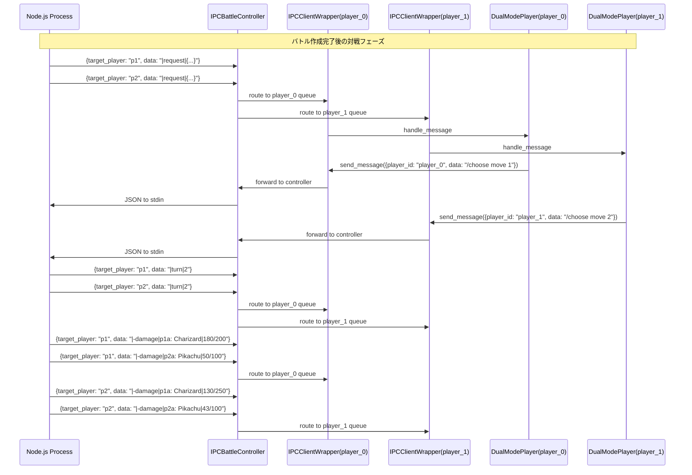
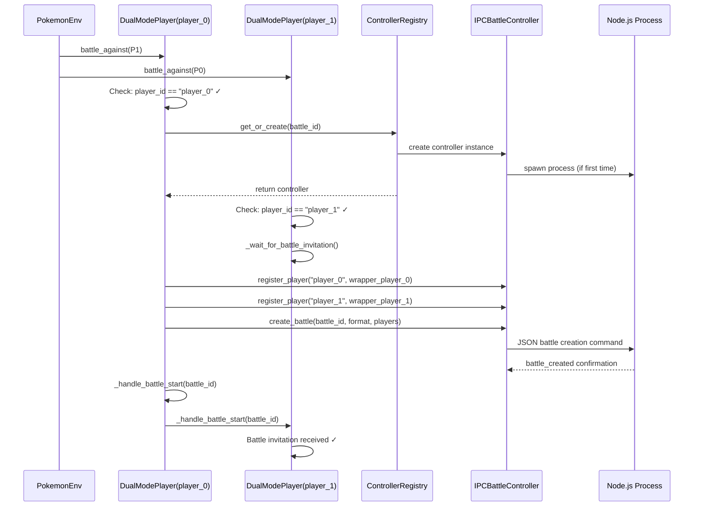

# IPC Battle アーキテクチャ

<!-- toc -->

## Major Principles

1. **One-battle-per-process** – 1 バトルにつき 1 つの Node.js プロセス（＝Showdown サーバー）を立ち上げ、完全に隔離された実行環境を確保する。
2. **Transport-only replacement** – バトルロジックや *Showdown 生テキスト* は一切変更せず、輸送層だけを WebSocket から *STDIN/STDOUT 上の JSON* へ置き換える。
3. **Player-scoped messaging** – Node.js 側が `target_player` メタデータを付与し、Python 側 (`IPCBattleController`) がプレイヤーごとのキューに振り分ける.
4. **Id mapping at the boundary** – Showdown 側は `p1` / `p2`、PokemonEnv 側は `player_0` / `player_1` を用いる。広域改修は避け、ID の相互変換は `IPCBattleController` / `IPCClientWrapper` の境界でのみ行う。
5. **Up-stream compatibility** – 既存 poke-env / Showdown の API・プロトコルとの互換性を最優先し、変更は最小限にとどめる。
6. **PSClient-first processing** – IPCClientWrapper は送受信の最小ラップのみに徹し、Showdown プロトコルメッセージは PSClient.listen/_handle_message にそのまま委譲（_handle_message はオーバーライドしない）。

---

## 概要（High-level Overview）

1 バトル 1 Node.js プロセス方式で Pokémon Showdown を実行する IPC 通信アーキテクチャです。各プレイヤーが独自の `IPCClientWrapper` を持ち、共有 Node.js プロセスと標準入出力を介して通信します。全メッセージにプレイヤー指定のメタデータを付与し、各 `IPCClientWrapper` が自分宛メッセージのみを処理します。

なお、Showdown 側は一貫して `p1` / `p2`、環境（PokemonEnv）側は `player_0` / `player_1` を用います。両者の ID 差分は `IPCBattleController` / `IPCClientWrapper` が責任を持って境界で相互変換し、他レイヤーへの影響を遮断します。

---

## コンポーネント

- **Node.jsプロセス**: 1バトル専用のShowdownサーバー。プレイヤー指定メタデータ付きメッセージを送受信
- **IPCBattleController**: Node.jsプロセス管理・メッセージルーティング・バトル制御・通信中継を一元管理（IPC 層の中核。専用の `IPCCommunicator` 等は作らず本クラスに集約）
- **IPCClientWrapper**: PSClient を IPC 通信で利用可能にするための「薄いラッパー」。送受信（stdin/stdout）とメッセージ種別判別（IPC制御か Showdown プロトコルか）のみを担当し、Showdown プロトコルと判断したメッセージは PSClient.listen/_handle_message にそのまま委譲（_handle_message はオーバーライドしない）。実際のプロセス管理や配信は `IPCBattleController` に委譲。
- **DualModePlayer**: 各プレイヤーが独自のIPCClientWrapperインスタンスを保持
- **BattleManager**: 複数バトルのNode.jsプロセス管理

---

## アーキテクチャ

```text
Battle 1: Node.js Process ←→ IPCBattleController ←→ IPCClientWrapper (player_0) ←→ DualModePlayer (player_0)
                                      ↑         ←→ IPCClientWrapper (player_1) ←→ DualModePlayer (player_1)
              
Battle 2: Node.js Process ←→ IPCBattleController ←→ IPCClientWrapper (player_0) ←→ DualModePlayer (player_0)  
                                      ↑         ←→ IPCClientWrapper (player_1) ←→ DualModePlayer (player_1)
```

- 1バトル = 1Node.jsプロセス = 1IPCBattleController = 2IPCClientWrapper
- IPCBattleControllerがNode.jsプロセスと直接通信
- メッセージルーティング機能でプレイヤー別に振り分け
- 各IPCClientWrapperは自分宛のメッセージのみ受信

---

## メッセージフォーマット

### JSON エンベロープ（プレイヤー指定）

全メッセージにプレイヤー指定メタデータを付与：

ID マッピングの方針:
- ワイヤ上（Node.js 側に渡る/から返る JSON）では常に `p1` / `p2` を使用
- アプリ内部（PokemonEnv 側）は `player_0` / `player_1` を使用
- `IPCBattleController` / `IPCClientWrapper` が境界で相互変換（例: `player_0` ⇔ `p1`、`player_1` ⇔ `p2`）

#### 送信（Python → Node.js）
```json
{
  "player_id": "p1",
  "battle_id": "battle-123",
  "data": "battle-gen9randombattle-123|/choose move 1"
}
```

#### 受信（Node.js → Python）
```json
{
  "type": "protocol",
  "battle_id": "battle-123", 
  "target_player": "p1",
  "data": ">battle-gen9randombattle-123\n|request|{...}"
}
```

### プレイヤー振り分け

- **Node.js**: 全メッセージに`target_player`を指定。共有メッセージは両プレイヤーに1回ずつ送信
- **IPCBattleController**: `target_player`（`p1`/`p2`）を `player_0` / `player_1` に変換し、該当プレイヤーのキューへ振り分け
- **IPCClientWrapper**: 自分専用のキューから自分宛のメッセージのみ受信（必要に応じて ID 変換を委譲）

---

## 通信フロー

### 送信（Python → Node.js）

1. IPCClientWrapper が（内部では `player_0`/`player_1` を用い）メッセージを作成
2. IPCBattleController 経由で Node.js の stdin に送信

### 受信（Node.js → Python）

1. Node.js が target_player 指定メッセージを stdout に出力
2. IPCBattleController が JSON を読み取り、target_player をチェック
3. `p1`/`p2` → `player_0`/`player_1` に変換し、適切なプレイヤーキューにメッセージを振り分け
4. IPCClientWrapper が自分専用のキューからメッセージを受信

### 実装例（IDマッピングを含む）

```python
# IPCBattleController内
async def route_message(self, message):
    id_map = {"p1": "player_0", "p2": "player_1"}
    target = message.get("target_player")
    if target == "both":
        for queue in self.player_queues.values():
            await queue.put(message["data"])
        return
    py_player = id_map.get(target)
    if py_player in self.player_queues:
        await self.player_queues[py_player].put(message["data"])

# IPCClientWrapper内
async def receive_message(self):
    # 自分専用のキューから受信
    msg = await self._message_queue.get()
    return msg

async def listen(self):
    # PSClient の標準ループと同等に、受信メッセージを分類して委譲
    while True:
        raw = await self.receive_message()
        if self._is_ipc_control(raw):
            await self._handle_ipc_control(raw)  # ping/pong 等
        else:
            # Showdown プロトコル: そのまま PSClient の処理系に委譲
            await self.ps_client._handle_message(raw)  # _handle_message はオーバーライドしない
```

---

## 対戦中のメッセージシーケンス図

### HP表示の仕様
Pokemon Showdownでは、プレイヤーごとに異なるHP情報が表示されます：
- **自分のポケモン**: 実際のHP数値が表示される（例: `180/200`）
- **相手のポケモン**: HPの割合が表示される（例: `90/100` = 90%）

この仕様により、各プレイヤーは自分のポケモンの正確な状態を把握しつつ、相手のポケモンについては割合のみ知ることができます。



---

## 実装要件

- **POKE_LOOP互換**: 標準`asyncio.subprocess`を使用してPOKE_LOOPとの完全互換性を確保
- **PSClient互換 I/F**: IPCClientWrapper は送受信と種別判別のみを担当し、Showdown プロトコルメッセージは PSClient.listen/_handle_message に委譲（_handle_message はオーバーライドしない）
- **プラットフォーム対応**: Windows/Unix両対応のプロセス作成・終了処理
- **プロセス管理**: BattleManagerによる複数バトルのNode.jsプロセス管理
- **エラーハンドリング**: プロセス異常終了・通信エラーの適切な処理

## バトル作成

### 概要

IPCモードでは、WebSocketモードの challenge/accept メカニズムとは異なり、直接的なバトル作成フローを使用します。バトル作成の重複を防ぐため、`p1` のみがバトル作成を担当し、`p2` は参加者として待機します。

### 処理フロー

1. **PokemonEnv によるバトル開始**
   ```python
   # PokemonEnv._run_battle() が両プレイヤーで同時に呼び出す
   await asyncio.gather(
       self._env_players["player_0"].battle_against(
           self._env_players["player_1"], n_battles=1
       ),
       self._env_players["player_1"].battle_against(
           self._env_players["player_0"], n_battles=1
       ),
   )
   ```

2. **player_0 側の処理（バトル作成者）**
   ```python
   # DualModeEnvPlayer.battle_against()
   if self.player_id == "player_0":
       battle_id = f"battle-{timestamp}-{unique_id}"
       await self._create_ipc_battle(battle_id, opponent)
   ```

3. **player_1 側の処理（バトル参加者）**
   ```python
   # DualModeEnvPlayer.battle_against()
   if self.player_id == "player_1":
       # player_0 からのバトル開始通知を待機
       await self._wait_for_battle_invitation()
   ```

4. **バトル作成の詳細ステップ（player_0 が実行）**
   ```
   _create_ipc_battle(battle_id, opponent):
   ├─ 1. IPCBattleController の取得・作成
   │   └─ controller = ControllerRegistry.get_or_create(battle_id)
   │       └─ 初回のみ Node.js プロセス起動
   │
   ├─ 2. 両プレイヤーの IPCClientWrapper 作成・登録
   │   ├─ wrapper_player_0 = IPCClientWrapper(controller, "player_0")
   │   ├─ wrapper_player_1 = IPCClientWrapper(controller, "player_1")
   │   └─ controller.register_player("player_0", wrapper_player_0)
   │       controller.register_player("player_1", wrapper_player_1)
   │
   ├─ 3. プロセス接続と疎通確認
   │   └─ await asyncio.gather(
   │         controller.connect(), controller.ping(),
   │       )
   │
   ├─ 4. バトル作成コマンド送信
   │   └─ await controller.create_battle(battle_id, format, players)
   │
   └─ 5. 両プレイヤーへの開始通知
       ├─ await self._handle_battle_start(battle_id)
       └─ await opponent._handle_battle_start(battle_id)
   ```

### バトル作成時のメッセージシーケンス図



### 利点

- **単純性**: player_0 のみがバトル作成を担当する明確なルール
- **重複防止**: 同じバトルが2回作成されることを確実に防止
- **WebSocket互換**: WebSocketモードの challenge/accept パターンと類似の非対称性
- **エラー処理**: バトル作成の失敗が player_0 で一元的に処理可能

---

## IPCBattleController

### 概要

IPCBattleControllerは、PythonとNode.jsプロセス間のIPC通信とバトル制御を統合管理する低レイヤークラスです。Node.jsプロセスのライフサイクル管理、メッセージルーティング、バトル作成・管理機能を提供します。

### 必要な機能リスト

#### 1. **プロセス管理機能**
- Node.jsプロセスの起動（`spawn_process`）
- プロセスの正常終了（`terminate_process`）
- プロセスの生存確認（`is_alive`）
- 異常終了時の再起動（`restart_process`）
- プロセスIDの管理（`get_pid`）

#### 2. **通信機能**
- JSONメッセージ送信（`send_json`）
- JSONメッセージ受信（`receive_json`）
- 標準出力の非同期読み取り（`_read_stdout`）
- 標準エラー出力の監視（`_read_stderr`）
- 通信バッファ管理（`_manage_buffers`）

#### 3. **バトル管理機能**
- バトルの作成（`create_battle`）
- バトルIDの生成・管理（`generate_battle_id`）
- バトル状態の取得（`get_battle_state`）
- バトルの終了（`end_battle`）
- アクティブバトルの追跡（`track_active_battles`）

#### 4. **接続管理機能**
- プレイヤー接続の登録（`register_player`）
- プレイヤー接続の解除（`unregister_player`）
- 接続プレイヤー数の確認（`get_connected_players`）
- 接続状態の監視（`monitor_connections`）

#### 5. **メッセージルーティング機能**
- プレイヤー別メッセージキュー（`player_queues`）
- メッセージの振り分け（`route_message`）
- ブロードキャストメッセージ送信（`broadcast_message`）
- プレイヤー固有メッセージ送信（`send_to_player`）

#### 6. **エラーハンドリング機能**
- プロセスクラッシュ検出（`detect_crash`）
- タイムアウト処理（`handle_timeout`）
- エラーログ収集（`collect_error_logs`）
- グレースフルシャットダウン（`graceful_shutdown`）

### クラス構造

```python
class IPCBattleController:
    """IPC通信とバトル制御を統合管理するコントローラークラス.
    
    Node.jsプロセスのライフサイクル管理、メッセージルーティング、
    バトル作成・管理機能を提供する。
    """
    
    def __init__(self, node_script_path: str, battle_id: str):
        self.node_script_path = node_script_path
        self.battle_id = battle_id
        self.process: Optional[asyncio.subprocess.Process] = None
        self.player_queues: Dict[str, asyncio.Queue] = {}
        self.active_players: Set[str] = set()
        self._lock = asyncio.Lock()
        # 表記ゆれの相互変換を境界で吸収
        self._id_map_py2sd = {"player_0": "p1", "player_1": "p2"}
        self._id_map_sd2py = {v: k for k, v in self._id_map_py2sd.items()}
```

---

## 参考

* **プロトコル仕様**: `docs/nodejs-ipc-development/SHOWDOWN_MESSAGE_SPEC.md`
* **実装**: `src/env/dual_mode_player.py` 内の `IPCClientWrapper`（薄いラッパー）と、今後追加予定の `IPCBattleController`（IPC 層の中核）

---

## WebSocket と IPC のプロトコル差分

このドキュメントは *「通信プロトコルが異なる以外は WebSocket 版 Showdown のフルコピーである」* という設計原則を前提にしている。したがって **メッセージペイロードのフォーマット** は poke-env が既に理解できる *Showdown 生テキスト* を保つ必要がある。一方で **輸送層**（転送経路）は WebSocket から *STDIN/STDOUT を用いた JSON* に置き換えられる。本節では両モードの主な相違点を 1 行で比較し、その影響範囲を明示する。

| 項目 | WebSocket モード | IPC モード |
| --- | --- | --- |
| 物理チャネル | TCP + WebSocket | 同一ホスト内のパイプ (stdin / stdout) |
| メッセージ単位 | テキスト (改行区切り) | JSON エンベロープ (data フィールドにテキスト) |
| メタデータ | なし | `type` / `battle_id` / `target_player` など追加 |
| Ping/Pong | SockJS / WS Ping | `{"type":"ping"}` / `{"type":"pong"}` |
| 認証 | ログイン/チャレンジ文字列 | ローカルのためダミー認証 |
| 多重配信 | ソケット毎に broadcast | `target_player` で Python 側が複製 |

### 互換性の担保ポイント

1. **data フィールドはロスレス**  – 受信した JSON から `data` をそのまま取り出せば、poke-env の `Battle.parse_message()` が従来通り動く。
2. **行区切り規約の維持**  – `"data"` 内では改行と `|` 区切りを完全保存する。
3. **プレイヤー視点の差分伝播**  – Node.js が `target_player` を正しく設定することで、各クライアントは自分視点の HP 情報を受け取れる。

---

## クラス別の変更点まとめ

| 層 | クラス / ファイル | WebSocket 版での役割 | IPC 版での取り扱い |
| --- | --- | --- | --- |
| Node.js (Showdown) | `Sockets.Socket`, `server/sockets/*` | ネットワークソケットの管理 | **置換** → `IPCConnection` (STDIN/STDOUT) |
|  | `Rooms.*`, `BattleStream`, `Dex`, ルール類 | バトルロジック全般 | **変更不要** (そのまま再利用) |
|  | 認証モジュール | auth / verifier | **Stub 化** – ローカルなので常に成功 |
|  | Ping/Pong ハンドラ | WS Ping | JSON Ping/Pong へ差し替え |
| Python (環境側) | `poke_env.player.Player`, `Battle` | 戦闘解析・行動決定 | **変更不要** |
|  | `PSClient` | メッセージ受信・_handle_message | **変更不要**（_handle_message はオーバーライドしない） |
|  | `src/sim/battle_communicator.WebSocketCommunicator` | WS 送受信ラッパ | 既存のまま（IPC 用の Communicator は新設しない） |
|  | `src/env/dual_mode_player.DualModeEnvPlayer` | モード選択 | IPC モード時でも内部は `IPCClientWrapper` → `IPCBattleController` を使用 |
|  | `IPCClientWrapper` | ― | **実装必須** – Controller 経由での I/F を提供（薄いラッパー） |
|  | `IPCBattleController` | ― | **実装必須** – プロセス管理 / ルーティング / 中継の一元化 |

### 実装優先度（計画更新）

1. `IPCBattleController` と `IPCClientWrapper` の最小経路（プロセス起動 / STDIN・STDOUT の NDJSON 読み書き / Ping-Pong / ルーティング / ID 変換）
2. DualModeEnvPlayer.battle_against() の非対称化（`player_0` が作成、`player_1` は招待待ち）
3. Node.js 側は必要最小限のブリッジのみ（クラス新設は不要）。Showdown 生テキストを `data` に格納し、`target_player` を付与して出力

---

## 論理的整合性チェック（計画更新を反映）

1. 本ドキュメントは「コンポーネント → プロトコル → フロー → 実装要件 → バトル作成 → 差分 → クラス変更点」という階層で記述されており、上位概念から順に詳細へブレイクダウンしている。
2. 新規クラスは `IPCClientWrapper` と `IPCBattleController` に限定し、それぞれの責務を本文で明示した。
3. WebSocket 版からの **不変ポイント**（バトルロジック、メッセージペイロード）の保持理由と方法が明示されている。
4. JSON エンベロープ例とテーブルで必須キーを列挙し、一読で実装可能な情報粒度になっている。
5. 参考リンクは関連仕様ファイル (`SHOWDOWN_MESSAGE_SPEC.md`) と実装エントリポイントを網羅している。

以上により、後続の実装フェーズでドキュメントを参照した際に過不足のない情報が揃うことを確認した。
